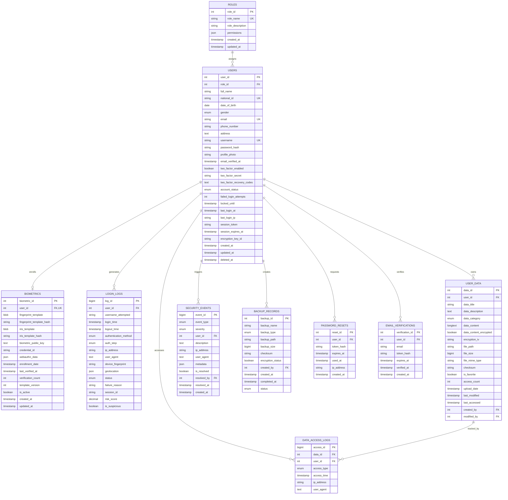

## BioSecure Data Vault - Entity Relationship Diagram

### Relationship Cardinality

| Relationship | Type | Description |
|-------------|------|-------------|
| ROLES → USERS | 1:N | One role can be assigned to many users |
| USERS → BIOMETRICS | 1:1 | One user has exactly one biometric record |
| USERS → LOGIN_LOGS | 1:N | One user generates many login logs |
| USERS → USER_DATA | 1:N | One user owns many data records |
| USERS → DATA_ACCESS_LOGS | 1:N | One user creates many access logs |
| USER_DATA → DATA_ACCESS_LOGS | 1:N | One data record has many access logs |
| USERS → SECURITY_EVENTS | 1:N | One user triggers many security events |
| USERS → BACKUP_RECORDS | 1:N | One user can create many backups |
| USERS → PASSWORD_RESETS | 1:N | One user can request many password resets |
| USERS → EMAIL_VERIFICATIONS | 1:N | One user can have many verification attempts |

### Index Strategy
- **Primary Keys**: All tables use AUTO_INCREMENT INT/BIGINT
- **Unique Constraints**: national_id, email, username, user_id in biometrics
- **Foreign Keys**: Properly indexed for JOIN performance
- **Search Indexes**: Full-text on data_title + data_description
- **Audit Indexes**: login_time, ip_address for security queries
- **Status Indexes**: account_status, event severity for dashboard queries
